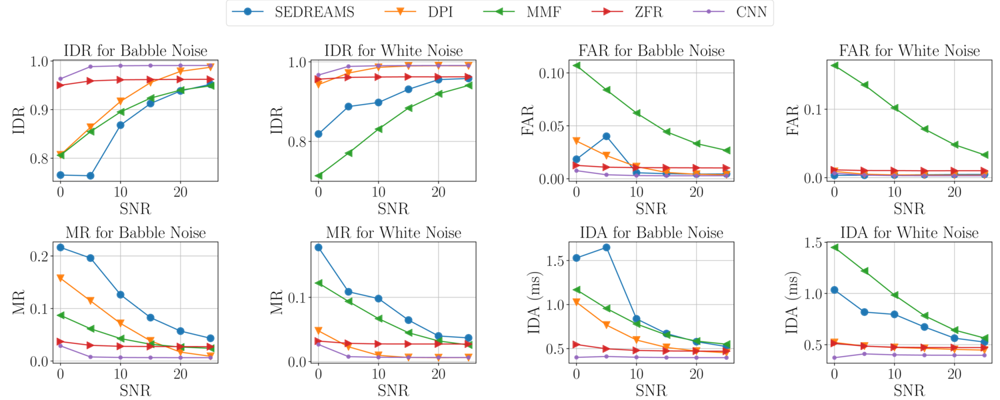
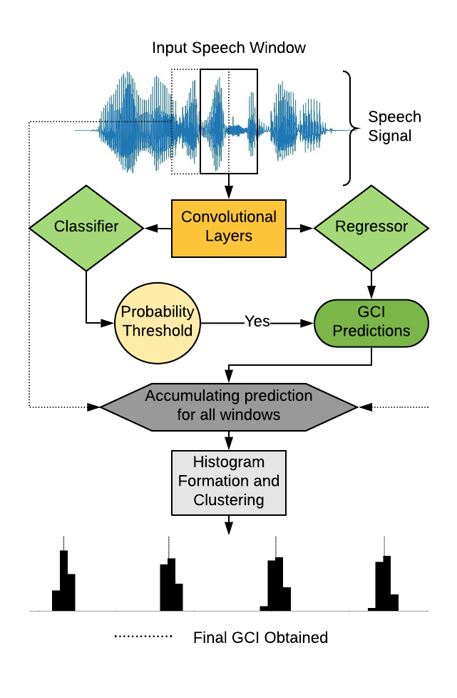

# DCNN

Code for Detection of Glottal Closure Instants using Deep Dilated Convolutional Neural Networks [<mark>[Paper]</mark>](https://arxiv.org/abs/1804.10147)
_Published in INTERSPEECH-2019 (poster)_

Authors: Mohit Goyal\*, Varun Srivastava\*, Prathosh A.P.

## Abstract

---

>Glottal Closure Instants (GCIs) correspond to the temporal locations of significant excitation to the vocal tract occurring during the production of voiced speech. GCI detection from speech signals is a well-studied problem given its importance in speech processing. Most of the existing approaches for GCI detection adopt a two-stage approach (i) Transformation of speech signal into a representative signal where GCIs are localized better, (ii) extraction of GCIs using the representative signal obtained in first stage. The former stage is accomplished using signal processing techniques based on the principles of speech production and the latter with heuristic-algorithms such as dynamic-programming and peak-picking. These methods are thus task-specific and rely on the methods used for representative signal extraction. However, in this paper, we formulate the GCI detection problem from a representation learning perspective where appropriate representation is implicitly learned from the raw-speech data samples. Specifically, GCI detection is cast as a supervised multi-task learning problem solved using a deep convolutional neural network jointly optimizing a classification and regression cost. The learning capability is demonstrated with several experiments on standard datasets. The results compare well with the state-of-the-art algorithms while performing better in the case of presence of real-world non-stationary noise.

## Dataset
---

The given code has been tested on the CMU Arctic Dataset for the speakers BDL, JMK, SLT available online at [CMU Database](http://www.festvox.org/cmu_arctic/)

## Requirements
1. Python 3.6 or greater
2. Pytorch (GPU*/CPU)

## Running Experiments
---

All source files have been written in python, with the exception of minor utility scripts written in bash. They are not required for running the training code.
The broad codebase can be divided into the following three parts:

- Preprocessing
- Training and Validation
- Visualization

The pipeline for each is explained below.

### Preprocessing

### Training and Validation

### Visualization

\* _Equal Contribution_
